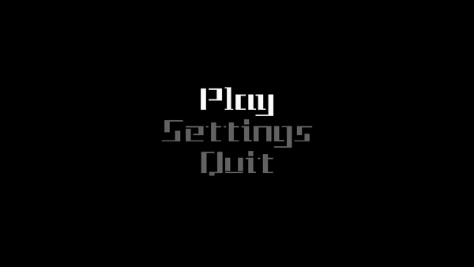
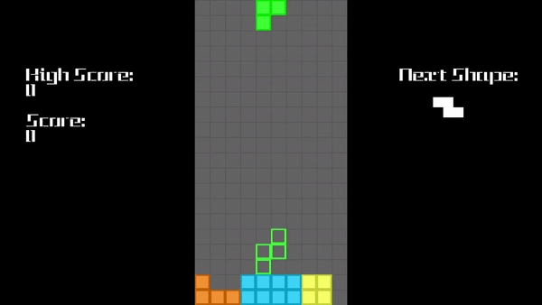

# Tetris Clone

   Tetris clone made using Python and Pygame

   Welcome to my Tetris Clone!

## How to Install

   1. Install Python 3 from <code><https://www.python.org/></code>.
   2. Download and unzip the folder from GitHub.
   3. Open command prompt or terminal within the unzipped folder
      * (this can be done on Windows by typing 'cmd' and pressing enter in the address bar of the folder).
   3. Type <code>python -m venv t_env</code> and press enter.

   4. Then type <code>t_env\Scripts\activate</code> and press enter again.
   5. Input <code>pip install -r requirements.txt</code> and press enter.
   6. Finally, <code>deactivate</code> then enter.

## HOW TO RUN

The game can be run by going into the command prompt or terminal of the unzipped folder again and inputting <code>python main_file.py</code> and pressing enter.

OR

You can run run <code>main_file.py</code> using Python.exe.

## Required Files/Installations

      Python 3

      Pygame

      scores.txt

      Tetris.ttf

      MainFile.py

      Screen_Class.py

      Shape_Class.py

      Start_Pause.py

# Controls

### Menu

      > UP/W - Move up

      > DOWN/S - Move down

      > LEFT/A - Change value left

      > RIGHT/D - Change value right

      > RETURN/SPACE - SELECT

      > Q - Quit

      > ESC - Return to main menu (only if in settings)

### In Game

      > UP/W/X - Rotate Clockwise

      > Z - Rotate Counterclockwise 

      > LEFT/A - Move left

      > RIGHT/D - Move right

      > SPACE - Hard drop

      > ESC/P - Pause

      > Q - Quit

## Screenshots

Menu

Gameplay

## Usability

   This code can be viewed and used for personal use, but not commercially or represented as one's own code.

## Authors

      Code created by dennis-kap
